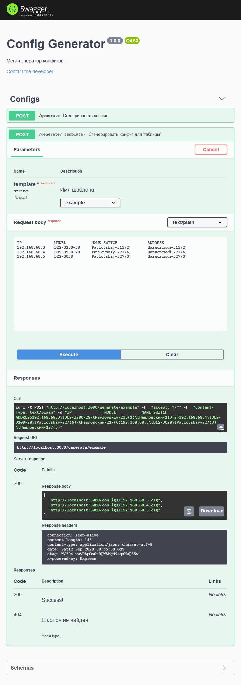

### Требования
Для работы необходима установленная [NodeJS](https://nodejs.org/en/download/).

### Запуск
Для запуска используется `start.cmd`.

### Шаблоны
Шаблоны расположены в папке `templates`. Для создания нового шаблона, положите туда текстовый файл. Переменные в шаблоне начинаются со знака `$`.

### Работа
Интерфейс доступен по адресу http://localhost:3000.

Для массовой генерации конфигов используется таблица, разделенная табами/пробелами.
```txt
IP              MODEL           NAME_SWITCH         ADDRESS
192.168.68.3    DES-3200-28     Pavlovskiy-213(2)   Павловский-213(2)
192.168.68.4    DES-3200-28     Pavlovskiy-227(6)   Павловский-227(6)
192.168.68.5    DES-3028        Pavlovskiy-227(3)   Павловский-227(3)
```
В первой строке содержится название переменной, в строках их значение. На каждую строку будет сгенерирован свой конфиг. В качестве имени конфига используется переменная `IP` или `NAME_SWITCH`.

### Внешний вид
